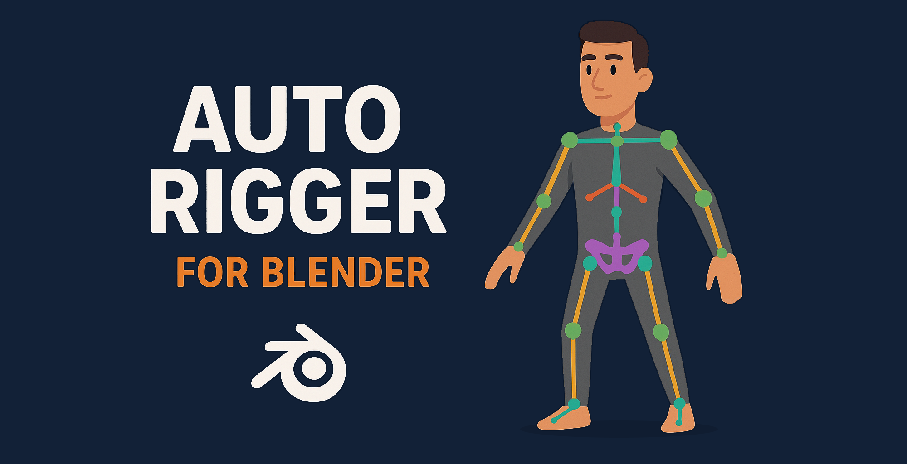

#  Blender Auto Rigger  
_Auto-rigging tool for low-poly characters in Blender_

##  Features  
 ✅ **One-Click Rigging** – Generates a basic humanoid skeleton.  
 ✅ **Automatic Mesh Binding** – Uses automatic weights for skinning.  
 ✅ **User-Friendly UI** – Simple sidebar panel inside Blender.  
 ✅ **Lightweight & Fast** – Designed for low-poly characters.  

---

##  Installation  
1. **Download the ZIP**  
   - Click the green **"Code"** button > **Download ZIP**  
2. **Install in Blender**  
   - Open **Blender**  
   - Go to **Edit > Preferences > Add-ons**  
   - Click **Install...** and select `BlenderAutoRigger.zip`  
   - Enable the add-on in the **Rigging** category  
3. **Access the Tool**  
   - Open the **3D Viewport**  
   - Press **N** to open the sidebar  
   - Navigate to the **Auto Rigger** panel  

---

##  Usage  
1. **Generate the Rig**  
   - In the 3D View sidebar, navigate to the "Auto Rigger" tab  
   - Click the **"Generate Rig"** button  
   - *(A humanoid skeleton named "AutoRig" will appear at scene origin)*

2. **Prepare Your Character**  
   - Select your character mesh in Object Mode  
   - Ensure mesh is properly scaled and positioned near the rig  
   - *(Tip: Use "Resize to Mesh" if proportions don't match)*

3. **Bind the Mesh**  
   - With your mesh selected, click **"Bind Mesh"**  
   - *(This creates an Armature modifier with automatic weights)*

4. **Final Adjustments**  
   - Enter Weight Paint mode to refine influences if needed  
   - Start animating with the ready-to-use rig!